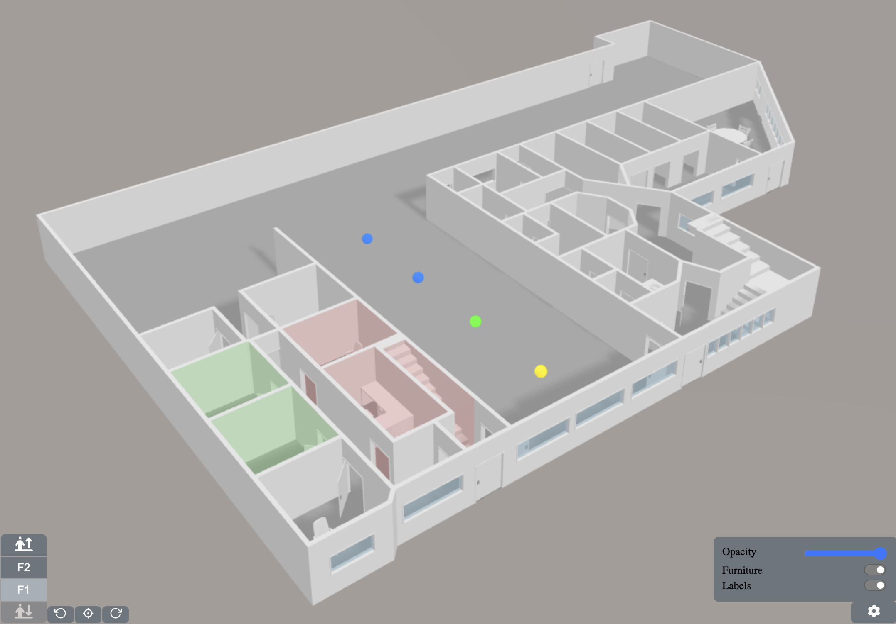
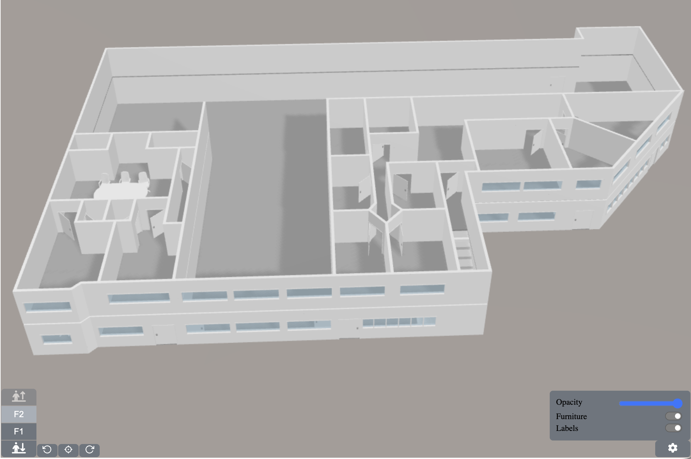
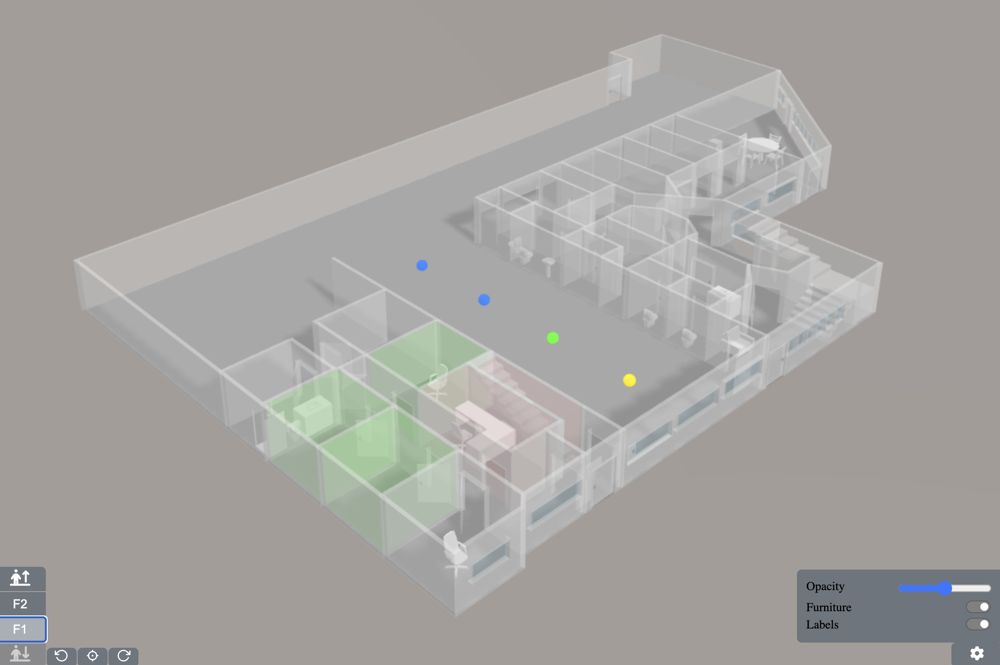

# Digital Twin Demo

- This is a simple digital twin of my company's workspace.
- Live demo: https://thanhquocuit.github.io/digital-twin-threejs/

## Tech stack
- Frontend: [ReactJS](https://react.dev/) (player + editor)
- Graphic engine: [ThreeJS](https://threejs.org/)
- Export data format: JSON

## What to demo
- Dots are an example of sensor locations in the building.
- Room polygons are an example of rooms with alert information.

## How to control
- LEFT MOUSE to rotate.
- RIGHT MOUSE to pan.
- MOUSE WHEEL to zoom in/out.
- Click on the control buttons  to navigate between floors
- Click on the settings button  to toggle on/off features

## Web Editor
- You can use our web editor to create new spaces (Sorry! The public editor is not yet available)

## Screenshots

